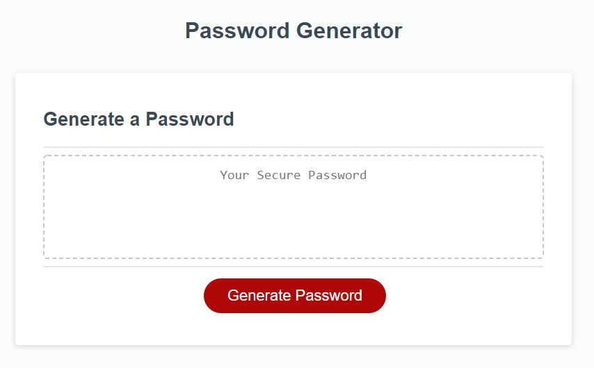
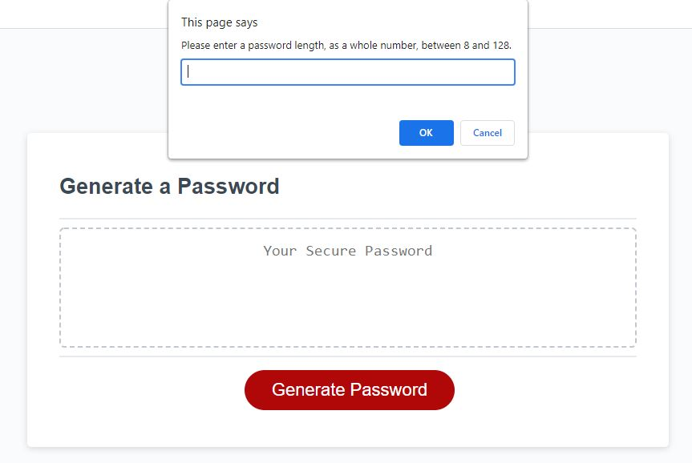
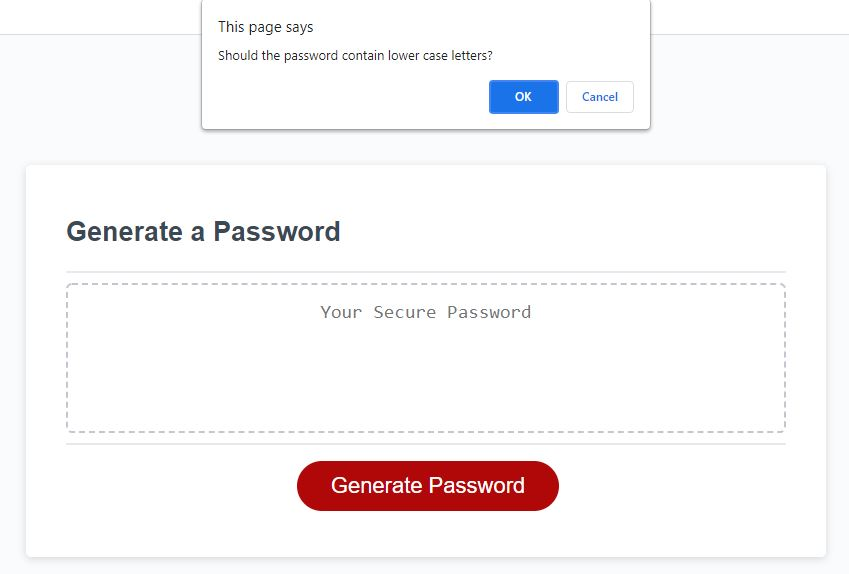
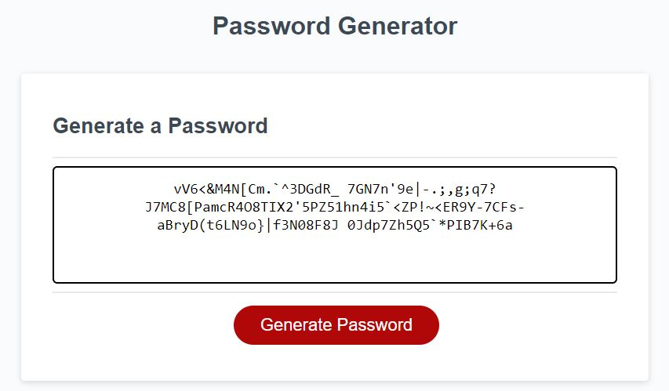

# Random-Password_Generator

## Description

This app generates a random password for better security. It features a straightforward styling with a text box to display the password, once generated, and a button to trigger the apps functions. This project challenged me to better understand javascript. Particularly how data is passed into and out of functions, how to access what is stored in objects, and how to effectively loop. It also reinforced how to traverse to specific DOM elements.

## Usage

Below is what is displayed upon navigating to the app.

Upon pressing the "Generate Password" button the user is asked to enter a password length, and which characters they'd like to be used for the password. Examples of this are shown below.

Entering anything other than a numeric value between 8 and 128 will result in the user being asked to enter valid input. Likewise, not selecting at least one of the character choices will result in the user being asked to choose character types again. After valid criteria has been selected, javascript functions execute to produce a password with at least one of each type of selected criteria, of the appropriate length. This password is then displayed in the text area on screen. An example is shown below.

This is a link of the deployed application: https://xanschwarz.github.io/Random-Password_Generator/
